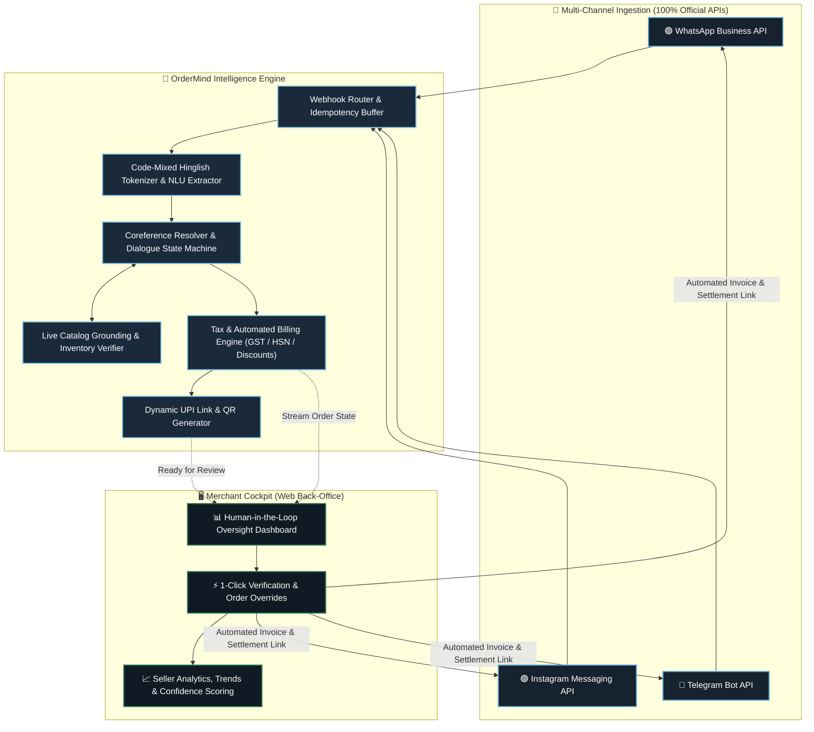

<div align="center">

<br />

# 🧠 OrderMind

### *From Chat Chaos to Clean Orders, Instant Invoices & Reconciled UPI Payments*
<br />

[](https://react.dev/)
[](https://www.typescriptlang.org/)
[](https://vite.dev/)
[](https://oxc.rs/)
[](LICENSE)

<br />

[](https://business.whatsapp.com/)
[](https://developers.facebook.com/docs/messenger-platform/instagram/)
[](https://core.telegram.org/bots/api)
[](#-mission)
[](https://github.com/abhinavbahadursingh/OrderMind/pulls)

<br />

[⚡ **Quick Start**](#-quick-start) •
[🎯 **Live Transformation**](#-the-live-transformation) •
[🥊 **Problem vs Solution**](#-the-problem-vs-the-solution) •
[🔄 **6-Stage Pipeline**](#-the-6-stage-pipeline) •
[🏗️ **Architecture**](#-system-architecture) •
[🗣️ **Hinglish NLU**](#-hinglish-nlu--dialogue-state-in-action) •
[🖥️ **Pages & Cockpit**](#-pages--screens) •
[🛠️ **Tech Stack**](#-tech-stack) •
[🗂️ **Project Anatomy**](#-project-anatomy)

<br />

</div>

---

## ⚡ Quick Start

Get the entire development environment and seller cockpit up and running in under **30 seconds**:

### 1️⃣ Clone the Repository

```bash
git clone https://github.com/abhinavbahadursingh/OrderMind.git
cd OrderMind
```

### 2️⃣ Install Dependencies

```bash
npm install
```

### 3️⃣ Launch the Dev Server

```bash
npm run dev
```

> [!TIP]
> The Vite dev server spins up instantaneously at **`http://localhost:5173`**.
> Open it in your browser to explore the live pipeline simulations, interactive order states, and seller cockpit!


## 🎯 The Live Transformation

Here is how OrderMind converts conversational mess into structured commerce in real time:

<table>
<tr>
<th width="33%" align="center">💬 1. Incoming Customer Chat</th>
<th width="33%" align="center">⚙️ 2. Coreference & State Resolver</th>
<th width="33%" align="center">🧾 3. Generated Tax Invoice & UPI</th>
</tr>
<tr>
<td valign="top">

```text
Customer:
"bhai blue wali shirt bhejna size M"

Customer:
"haan 2 piece"

Customer:
"wait black kar do na"

Customer:
"L bhi chalega agar M nahi hai"

Customer:
"kitna hua total?"
```

> *Messy, code-mixed Hinglish across multiple message turns with color & quantity revisions.*

</td>
<td valign="top">

```json
{
  "order_id": "ORD-8492",
  "channel": "WhatsApp",
  "customer": "+91 98765 43210",
  "items": [
    {
      "sku": "SHIRT-COT-BLK-M",
      "name": "Cotton Classic Shirt",
      "color": "Black",
      "size": "M",
      "fallback_size": "L",
      "quantity": 2,
      "unit_price": 899.00
    }
  ],
  "confidence": 0.96,
  "status": "confirmed"
}
```

> *Live dialogue state machine tracks incremental corrections without starting over.*

</td>
<td valign="top">

```text
┌─────────────────────────────────┐
│ TAX INVOICE #INV-2026-0849     │
│ OrderMind Commerce Platform     │
├─────────────────────────────────┤
│ Item                Qty  Amount │
│ Cotton Shirt (Blk/M)  2   ₹1,798│
├─────────────────────────────────┤
│ Subtotal:                ₹1,798 │
│ GST (5%):                   ₹90 │
│ Shipping:                  FREE │
│ ─────────────────────────────── │
│ TOTAL PAYABLE:           ₹1,888 │
├─────────────────────────────────┤
│ ⚡ UPI Link:                    │
│ upi://pay?pa=seller@bank&am=1888│
└─────────────────────────────────┘
```

> *Ready for 1-click seller review and instant delivery back to the customer's chat.*

</td>
</tr>
</table>

---

## 🥊 The Problem vs The Solution

<table>
<tr>
<th width="50%" align="center">❌ Traditional Chat Selling (Manual Chaos)</th>
<th width="50%" align="center">✅ The OrderMind Operating System</th>
</tr>
<tr>
<td valign="top">

- ⏳ **Mental Load & Fragmentation**: Sellers spend 4–6 hours daily scrolling up and down chat histories to remember what was discussed.
- 🔁 **Correction Cascades**: Every time a buyer says *"wait, make that blue instead"* or *"send 3 instead of 2"*, the seller has to manually recalculate everything.
- 📝 **Double-Entry Friction**: Sellers re-type order items manually from WhatsApp into billing software, Google Sheets, or paper slips.
- 💸 **Lost Payments**: Screenshots of UPI payment receipts are scattered across dozens of individual direct message threads.
- ⚠️ **Stock Hallucinations**: Sellers quote out-of-stock items or outdated prices because they cannot check inventory while chatting.

</td>
<td valign="top">

- ⚡ **Autonomous Ingestion**: Listens across WhatsApp, Instagram, and Telegram using official webhooks with zero scraping.
- 🧠 **Code-Mixed NLU**: Purpose-built for Hinglish (*"bhai 2 piece pack kar dena"*), slang, and informal Indian shorthand.
- 🔄 **Coreference Tracking**: Accurately maps pronoun references (*"woh wali"*, *"isko replace karo"*) to the right line items.
- 🧾 **Zero-Entry Invoicing**: Formatted tax invoices with GST, HSN codes, and item discounts are created automatically upon customer confirmation.
- 🛡️ **Human-in-the-Loop Cockpit**: Sellers retain 100% control with a visual dashboard to approve, modify, or inspect orders before shipping.

</td>
</tr>
</table>

---

## 🏗️ System Architecture

OrderMind connects chat platforms, intelligence pipelines, and back-office oversight into a unified reactive stream:



---

## 🔄 The 6-Stage Pipeline

Every customer message traverses a deterministic six-stage lifecycle before converting into cash:

```
[ Stage 01 ] ──▶ [ Stage 02 ] ──▶ [ Stage 03 ] ──▶ [ Stage 04 ] ──▶ [ Stage 05 ] ──▶ [ Stage 06 ]
   INGEST           EXTRACT          STRUCTURE          GROUND             BILL             SETTLE
```

<table>
<tr>
<th>Stage</th>
<th>Name</th>
<th>What Happens Under the Hood</th>
<th>Key Output</th>
</tr>

<tr>
<td align="center"><b>01</b></td>
<td><b>📥 Ingestion</b></td>
<td>Listens to live webhook streams across WhatsApp Business, Instagram DM, and Telegram Bot APIs. De-duplicates messages, strips platform metadata, and organizes turns into thread sessions.</td>
<td><code>ThreadEvent</code></td>
</tr>

<tr>
<td align="center"><b>02</b></td>
<td><b>🔍 Extraction</b></td>
<td>Applies code-mixed Hinglish natural language parsing. Extracts named entities: product category, variant, colour, size, quantity, and user intent (inquire, revise, confirm, cancel).</td>
<td><code>ExtractedEntities[]</code></td>
</tr>

<tr>
<td align="center"><b>03</b></td>
<td><b>🧩 Structure</b></td>
<td>Maintains a persistent, single-source-of-truth order state object. Solves conversational coreference: *"make that black"* swaps the color of the preceding item without corrupting the rest of the cart.</td>
<td><code>OrderState (JSON)</code></td>
</tr>

<tr>
<td align="center"><b>04</b></td>
<td><b>📚 Grounding</b></td>
<td>Validates extracted items against the merchant's real product catalog and inventory database. Prevents model hallucinations, validates stock counts, and locks in authentic pricing.</td>
<td><code>CatalogVerifiedCart</code></td>
</tr>

<tr>
<td align="center"><b>05</b></td>
<td><b>🧾 Auto-Bill</b></td>
<td>The instant the customer confirms intent, OrderMind compiles line items, applies promotional coupons, computes tiered GST (5% / 12% / 18%), and generates a clean tax invoice.</td>
<td><code>InvoiceRecord</code></td>
</tr>

<tr>
<td align="center"><b>06</b></td>
<td><b>💳 Settlement</b></td>
<td>Constructs dynamic NPCI-compliant UPI payment deeplinks (GPay, PhonePe, Paytm, BHIM). Posts the invoice and link back to the chat while updating the seller's oversight dashboard.</td>
<td><code>UPIPaymentDeeplink</code></td>
</tr>
</table>

---

## 🗣️ Hinglish NLU & Dialogue State in Action

Social commerce in India happens in code-mixed Hindi and English. Here is how OrderMind handles complex multi-turn dialogues:

| Turn | Customer Utterance | Intent Detected | Order State Resolution |
|:---:|:---|:---|:---|
| **#1** | *"bhai blue wali shirt bhejna size M"* | `ADD_ITEM` | `+1 Cotton Shirt [Color: Blue, Size: M]` |
| **#2** | *"haan 2 piece"* | `UPDATE_QTY` | `Cotton Shirt [Qty: 1 ➔ 2]` |
| **#3** | *"wait black kar do na"* | `REPLACE_ATTRIBUTE` | `Cotton Shirt [Color: Blue ➔ Black]` |
| **#4** | *"L bhi chalega agar M nahi hai"* | `SET_FALLBACK` | `Backup preference stored: Size L` |
| **#5** | *"kitna hua total?"* | `REQUEST_CHECKOUT` | `Calculate subtotal + GST ➔ trigger bill generation` |

> [!NOTE]
> Notice how Turn #3 (*"wait black kar do na"*) does not trigger a new item or reset the quantity of 2. OrderMind's coreference engine detects that *"black"* modifies the attribute of the active cart line.

---

## ✨ Key Capabilities

<table>
<tr>
<td width="33%" valign="top">

### 🗣️ Hinglish Understanding
Native comprehension of Hindi-English code-mixing. Parses colloquial syntax (*"bhai woh wali bhejna"*, *"pack kar do"*) as effortlessly as standardized English.

</td>
<td width="33%" valign="top">

### ✏️ Incremental Editing
Coreference resolution maps follow-up modifications (*"make it 3"*, *"remove item 2"*, *"change size"*) to the exact line in the live order object.

</td>
<td width="33%" valign="top">

### 📚 Catalog Grounding
Entity matching is strictly bound to your verified product inventory and live SKU database. Zero hallucinations, zero incorrect prices.

</td>
</tr>
<tr>
<td width="33%" valign="top">

### 🧾 Automated Tax Invoicing
Computes line-item totals, applicable GST brackets (5%, 12%, 18%), discounts, and delivery fees into an instant branded invoice.

</td>
<td width="33%" valign="top">

### 🛡️ Human-in-the-Loop Cockpit
Every structured transaction arrives in an intuitive dashboard where merchants can inspect, manually adjust fields, and approve with a single click.

</td>
<td width="33%" valign="top">

### 🔌 Official Platform APIs
Connected exclusively via the WhatsApp Business Cloud API, Instagram Messaging API, and Telegram Bot API. 100% ToS-compliant, reliable, and secure.

</td>
</tr>
</table>

---

## 📱 Pages & Screens

OrderMind is equipped with a comprehensive frontend application:

```
src/pages/
├── Home.tsx            # /             → High-impact hero, pipeline preview, trust badges
├── HowItWorks.tsx      # /how-it-works → Interactive 6-stage pipeline deep dive with live chat threads
├── Features.tsx        # /features     → Detailed capability breakdown and technical specifications
├── Dashboard.tsx       # /dashboard    → Merchant triage cockpit with order approval queue
├── Stats.tsx           # /stats        → Comprehensive seller analytics, 30-day KPIs & trend graphs
├── About.tsx           # /about        → The chat commerce thesis and mission for micro-sellers
└── Contact.tsx         # /contact      → Merchant onboarding and partnership inquiry portal
```

| Route | Page | Purpose & Highlight |
|:---|:---|:---|
| `/` | **Home** | Interactive chat animations, conversion pipeline, capability cards, and social proof. |
| `/how-it-works` | **How It Works** | Step-by-step breakdown of Ingest, Extract, Structure, Revise, Bill, and Collect with live UI mocks. |
| `/features` | **Features** | Deep dive into Hinglish parsing, dialogue state tracking, catalog sync, and ToS compliance. |
| `/dashboard` | **Merchant Cockpit** | Live order triage screen featuring confidence scores, JSON inspection, and manual override actions. |
| `/stats` | **Seller Analytics** | Complete back-office command center: monthly revenue, order volumes, platform split, and sparkline charts. |
| `/about` | **About OrderMind** | Why social commerce in India needs a software back-office built for the micro-merchant. |
| `/contact` | **Contact & Onboarding** | Direct lead form and calendar booking for onboarding new seller stores. |

---

## 🛠️ Tech Stack

<div align="center">

| Core Framework | Type System | Build Engine | Linter & Quality | Design Architecture |
|:---:|:---:|:---:|:---:|:---:|
| **React 19.2** | **TypeScript 6.0** | **Vite 8.3** | **Oxlint** | **Liquid-Glass Design Tokens** |

</div>

- **Runtime & Engine**: React 19 concurrent rendering, React Router DOM 7 client routing.
- **Styling Architecture**: Flat matte surfaces paired with liquid-glass depth tokens (`--glass-fill`, `--glass-blur`, `--lift-1/2/3`). Zero heavy third-party UI libraries for maximum performance and instant load times.
- **Adaptive Appearance**: Built-in dark and light theme system with contrast-accessible CSS custom properties.
- **Interactions**: Fluid micro-animations powered by `IntersectionObserver` entrances and `requestAnimationFrame` scroll progress meters.
- **Static Analysis**: Oxlint executing 116+ lint rules across the codebase in **sub-100ms**.

---

## 🗂️ Project Anatomy

```text
OrderMind/
├── public/                     # Static assets, SVG icons, and favicons
│   ├── favicon.svg             # OrderMind brand mark
│   └── icons.svg               # SVG sprite definitions
├── src/
│   ├── components/             # Reusable UI component library
│   │   ├── CTABand.tsx         # Conversion bands and section headers
│   │   ├── DashboardPreview.tsx# Mini interactive triage mockup
│   │   ├── Footer.tsx          # Brand footer with navigation & links
│   │   ├── HeroVisual.tsx      # Animated incoming chat simulation
│   │   ├── Icons.tsx           # Accessible SVG icon registry & LogoMark
│   │   ├── Mocks.tsx           # ChatThread, OrderCard, StatePanel & Invoice
│   │   ├── Navbar.tsx          # Responsive top bar with theme toggle & scroll progress
│   │   ├── Pipeline.tsx        # Responsive stage timeline component
│   │   └── Reveal.tsx          # IntersectionObserver-based entrance transitions
│   ├── lib/                    # Utilities and application context
│   │   ├── pointer-fx.ts       # Subtle interactive pointer lighting effects
│   │   ├── theme-context.ts    # React theme context hook definition
│   │   └── theme.tsx           # LocalStorage-backed theme provider
│   ├── pages/                  # Page routes
│   │   ├── About.tsx           # Mission & audience overview
│   │   ├── Contact.tsx         # Merchant onboarding portal
│   │   ├── Dashboard.tsx       # Live order oversight queue
│   │   ├── Features.tsx        # Architectural capability breakdown
│   │   ├── Home.tsx            # Primary landing experience
│   │   ├── HowItWorks.tsx      # 6-stage interactive walkthrough
│   │   └── Stats.tsx           # Advanced seller analytics & KPI cockpit
│   ├── styles/                 # Modular CSS architecture
│   │   ├── base.css            # CSS reset, typography, and defaults
│   │   ├── layout.css          # Containers, responsive grids, and splits
│   │   ├── motion.css          # Animation keyframes and transition timing
│   │   ├── pages.css           # Page-specific styling rules
│   │   ├── stats.css           # Analytics dashboard and chart styling
│   │   ├── tokens.css          # Color tokens, glass fills, and elevation
│   │   └── ui.css              # Buttons, cards, pills, chips, and forms
│   ├── App.tsx                 # Client routing and application shell
│   └── main.tsx                # React DOM root entrypoint
├── package.json                # Project dependencies and script declarations
├── tsconfig.json               # TypeScript workspace configuration
└── vite.config.ts              # Vite bundler configuration
```

---

## 🔌 API Integrity & Safety

> [!IMPORTANT]
> **100% Official APIs — Never Scraping**
> OrderMind strictly interacts with social messaging platforms using approved, enterprise-grade developer APIs:
> - **Meta WhatsApp Business Cloud API**
> - **Meta Instagram Messaging API**
> - **Telegram Bot API**
>
> We do not use unauthorized automation, headless browser scrapers, or reverse-engineered protocols. Your seller account remains fully compliant with platform Terms of Service.

> [!TIP]
> **Human-in-the-Loop Safeguard**
> OrderMind never charges a customer or sends an unapproved invoice autonomously. Every transaction is queued in the seller's dashboard where a merchant can verify, modify, or approve the order with a single click.

---

## 🗺️ Roadmap

- [x] **Code-Mixed Hinglish NLU**: Extraction of product, variant, quantity, and intent.
- [x] **Dialogue State Machine**: Incremental editing and conversational coreference tracking.
- [x] **Automated GST Invoicing**: Calculation of 5%/12%/18% tax tiers and instant PDF/text invoice generation.
- [x] **Seller Cockpit & Oversight**: Order review queue with human-in-the-loop approvals.
- [x] **Comprehensive Analytics Suite**: 30-day order trends, revenue KPIs, and confidence scoring (`/stats`).
- [ ] **Voice Note Transcription Engine**: Parsing spoken Hindi/English voice messages into orders.
- [ ] **Multi-Warehouse Catalog Sync**: Real-time integration with Shopify, WooCommerce, and custom ERPs.
- [ ] **Automated Accounting Export**: One-click sync to Tally Prime, Zoho Books, and Vyapar.

---

## 💛 The Mission

> *"Give every small seller the back office that big enterprise brands take for granted — structured orders, honest invoices, and clear operational records — available to a two-person boutique selling in a WhatsApp group, not just to corporations with million-dollar ERP budgets."*

---

<div align="center">

**Built with ⚡ Vite • ⚛️ React 19 • 🔷 TypeScript • 🚀 Oxlint**

<br />

[⭐ **Star on GitHub**](https://github.com/abhinavbahadursingh/OrderMind) • [🐛 **Report an Issue**](https://github.com/abhinavbahadursingh/OrderMind/issues) • [💡 **Request a Feature**](https://github.com/abhinavbahadursingh/OrderMind/discussions)

<br />

Released under the [MIT License](LICENSE). Copyright © 2026 Abhinav Bahadur Singh.

</div>
